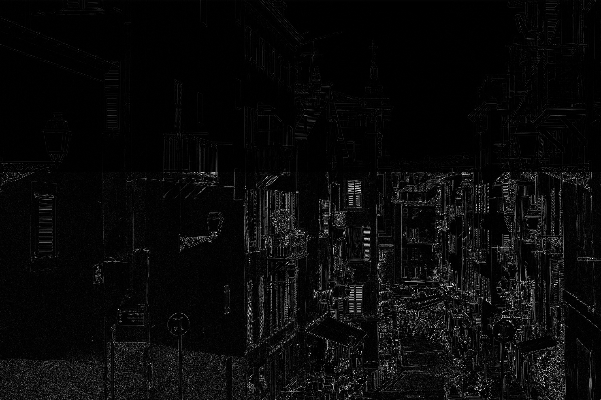

# Parallel 2D Convolution (CUDA)

Parallel implementation of 2D image convolution for grayscale images using CUDA.

## Overview

This project implements a 2D convolution operation in two versions:

- CPU (sequential implementation)
- GPU (parallel CUDA kernel)

The goal was to compare performance and analyze the computational speedup achieved through GPU acceleration.

---

## Input Image

---

## Output Image (After Convolution)

---

## Implementation Details

### GPU Version
- Custom CUDA kernel
- Grid/block configuration (16x16 threads per block)
- Global memory management
- Full pipeline benchmarking (memory transfer + kernel execution)
- Timing using `cudaEvent`

### CPU Version
- Sequential convolution implementation
- Timing using `std::chrono`

---

## Performance Benchmark

Tested on image size: **5773 × 8660**

| Implementation | Execution Time |
|---------------|---------------|
| CPU           | ~1937 ms      |
| GPU (full pipeline) | ~12 ms |

**Speedup: >100×**

The benchmark includes:
- Host → Device memory transfer
- Kernel execution
- Device → Host memory transfer

---

## Technologies

- C++
- CUDA
- OpenCV
- Visual Studio
- NVIDIA RTX 3070 Ti

---

## Key Concepts Demonstrated

- Parallel thread indexing (`blockIdx`, `threadIdx`)
- 2D grid and block configuration
- GPU global memory usage
- Performance benchmarking (CPU vs GPU)
- Speedup calculation

---

## Build

Project built using Visual Studio with CUDA Toolkit installed.

To run:
1. Place `input.jpg` in the project directory.
2. Build and run the solution.
3. The processed image will be saved as `new_img.jpg`.

---

## Author

Paweł Leszczyński
